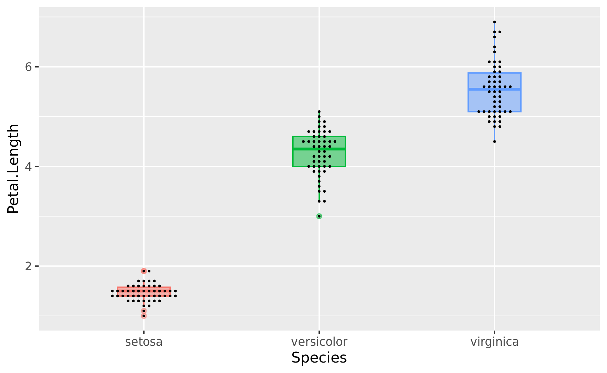

```{r setup, include=FALSE}
library(learnr)
library(tidyverse)
#library(magrittr)

knitr::opts_chunk$set(error = TRUE)

tutorial_options(exercise.timelimit = 10)

## start-over-automatically-at-everyaccess
options(tutorial.storage = list(
  # save an arbitrary R object "data" to storage
  save_object = function(tutorial_id, tutorial_version, user_id, object_id, data) {},
  # retreive a single R object from storage
  get_object = function(tutorial_id, tutorial_version, user_id, object_id) {NULL},
  # retreive a list of all R objects stored
  get_objects = function(tutorial_id, tutorial_version, user_id) {list()},
  # remove all stored R objects
  remove_all_objects = function(tutorial_id, tutorial_version, user_id) {}
))

#data_q <- read_csv("../r-basics/data/data_questionnaire.csv", show_col_types = F)
data_p <- read_csv("../r-basics/data/data_phyis.csv", show_col_types = F)

data_iris <- iris %>% 
  as_tibble()

#setwd("data")
```

## 準備

**このセクションのゴール**

1.  今回使うパッケージを読み込むことができる。
2.  `data_p`をプロット用にロングデータに変換できる。
3.  ggplot2のキャンバスを用意できる。

### パッケージの読み込み

`tidyverse`パッケージを読み込むと、今回使う`ggplot2`も併せて読み込まれます。

```{r prep, exercise=TRUE}
library(tidyverse)

```

### データの準備

ggplotでは、１行が１観測で１列が１変数という整然データ（ロングデータ）のデータを用意する必要があります。

今回は、`iris`というRに内蔵されているサンプルデータを使ってみます。

```{r prep_data, exercise=TRUE}
data_iris <- iris %>% 
  as_tibble() %>% 
  mutate(., id = 1:nrow(.)) %>% 
  relocate(id)

data_iris #構造を確認しておく

```

#### ワイドデータのロングデータへの変換

`iris`は元から整然データなので問題ありませんが、サンプルで用意している`data_p`はワイドデータ（condition1\~3が横並び）なので、データを少し変形する必要があります。

`pivot_longer()`を使うと、ワイドデータをロングデータに変換できます。

-   `cols`で縦につなげたい列を一括で指定します。ここでは列名がconditionで始まる(starts_with)列を一括で指定しました。

-   `names_to`で、縦につなげた列の列名を使って、conditionsという新しい列を作成するように指示しています。これがないと、縦につなげた後にどのデータがどの条件のものなのかわからなくなります。

-   `values_to`で、condition1\~3の列にあった観測値を縦に一つにまとめた列の、新しい列名(values)を指定しています。

```{r to_long, exercise=TRUE}
data_p_long <- pivot_longer(data = data_p, #元データ
                            cols = starts_with("condition"), #ロングデータにしたい列
                            names_to = "conditions", #新しく作る条件を示す列の列名
                            values_to = "values" #新しく作る観測値列の列名
                            ) 

data_p_long
```

コンソールに各データの変数名を入力して実行し、データの概要を把握しておいてください。また`data_p`と、`data_p_long`の違いを見てみてください。

```{r conf_data, exercise=TRUE, exercise.setup = "to_long"}
data_iris %>% 
  summary()

data_p

data_p_long
```

18行7列だった`data_p`が、54(=18人\*3条件）行6列となりました。`id`や`group`,`sex`そして`age`列が1,1,1,2,2,2,3,3,3のように、必要な数だけ自動的に複製されています。`pivot_longer()`の`cols`で指定しなかった列はすべて、自動的に複製されます。

### キャンバスの準備

`ggplot2`を使ったプロットは、キャンバスを準備するところから始まります。キャンバスには、プロットに使うデータや、縦軸横軸に使う列名など、プロット全体に影響を及ぼす設定を盛り込みます。

ほとんどの場面では、以下のような設定をします。

-   data （第1引数） でプロットに使うデータを指定

-   mapping = aes()で、x軸とy軸に使う列名を指定

```{r prep_canvas, exercise=TRUE, exercise.setup="conf_data"}
canvas_iris <- ggplot(data = data_iris, mapping = aes(x = Petal.Width, y = Sepal.Length))

canvas_p <- ggplot(data = data_p_long, mapping = aes(x = conditions, y = values))

```

キャンバスだけで一度プロットしてみましょう。

コンソールに`plot(キャンバスを入れた変数)`と入れてEnterか、ただ単に`変数名`を入力してEnterすると、現時点のキャンバスがプロットされます。

```{r check_canvas, exercise=TRUE, exercise.setup = "prep_canvas"}

plot(canvas_iris)

canvas_p

```

## プロットの保存

**このセクションのゴール**

1.  ggpot2プロットをtiffとして保存できる
2.  保存するときにdpi, サイズを指定できる

Rで作図した結果は、tiffなどのファイル形式で保存して、論文やパワポに使うことが多々あります。

特に論文用の図を作るときはDPI(解像度)の指定があることも多く、設定に悩むこともあると思います。

ここでは`ggsave()`関数を使って、ggplot2で作った図をコンピュータに保存する方法を見ていきます。

```{r save_plot1, exercise = TRUE, exercise.setup = "prep_canvas"}

ggsave(filename = "plot_p.tiff", #ファイル名
       plot = canvas_p)  #保存したいプロットの変数名

```

filenameとplotさえ指定すれば、とりあえずファイルを保存することはできます。

では、主題のサイズとDPI指定についてです。`ggsave()`の引数をさらに増やします。

ここでは120mm四方で、600DPIの図を提出するように求められていたとしましょう。

```{r save_plot2, exercise = TRUE, exercise.setup = "prep_canvas"}

ggsave(filename = "plot_p_600dpi.pdf", #ファイル名
       path = "data",            #保存先のパス（省略可）
       plot = canvas_p,          #保存したいプロットの変数名
       scale = 1,                #図の表示倍率（デフォルトは１）
       width = 120,             #横幅
       height = 120,            #縦幅
       units = "mm",            #横幅と縦幅の単位
       dpi = 600,               #解像度(dots per inch)
       compression= "lzw")      #可逆圧縮でファイルサイズ削減


```

なお、ファイルの拡張子を変えることで様々なファイルを書き出せますが、うまくいくものもあればうまくいかないものも。。。

-   .pdf

-   .tiff

-   .png

-   .bmp

-   .jpeg

-   .eps

-   .ps

-   .svg

-   .wmf (windows only)

## プロット基礎１（散布図）

**このセクションのゴール**

1.  ggpot2を使って、散布図を描くことができる
2.  散布図の各ポイントをirisのSpeciesごとに色分けできる
3.  散布図の各ポイントをirisのSpeciesごとに形分けできる
4.  散布図の各ポイントを半透明にできる

### とりあえず散布図を描いてみる

散布図は、先に用意したキャンバスに`geom_point()`を足すことで描画できます。

キャンバスを作るときにx軸に`Petal.Width`, y軸に`Sepal.Length`を設定したので、その設定が利用されます。

```{r scatter1, exercise = TRUE, exercise.setup = "prep_canvas"}

scatter_iris <- canvas_iris + geom_point()

```

`scatter_iris`とコンソールに入力して、プロット結果を見てみましょう。

```{r scatter2, exercise = TRUE, exercise.setup = "scatter1"}
scatter_i
```

### グラフの色分け

`ggplot2`では、様々な条件でグラフの見た目を変えることができます。まずは色分けをやってみましょう。

キャンバスを作るときの`aes(colour = 列名)`で、色分けに使う列を指定します。

```{r scatter_colour1, exercise = TRUE, exercise.setup = "scatter1"}

canvas_iris <- ggplot(data = data_iris, 
                      mapping = aes(x = Petal.Width, 
                                    y = Sepal.Length, 
                                    color = Species)) # <- ここ！

scatter_iris <- 
  canvas_iris + 
  geom_point() #散布図を指定

scatter_iris

```

凡例も自動で追加されます。

実はここで描画したプロットには、同じ点に複数のデータが存在している箇所があります。そこで、各点の透明度を50%に設定して、再度実行してみましょう。透明度は`geom_point(alpha = 0.5)`のように小数で指定します。

```{r scatter_colour2, exercise = TRUE, exercise.setup = "scatter_colour1"}

scatter_iris <- 
  canvas_iris +
  geom_point(alpha = 0.5)


scatter_iris
```

色が濃くなっている部分がポイントが重なった部分だとわかります。

## プロット基礎2（ボックスプロット・バイオリンプロット）

**このセクションのゴール**

1.  ggpot2を使って、ボックスプロットを描くことができる
2.  ggplot2を使って、バイオリンプロットを描くことができる
3.  ボックスプロットと散布図を重ね合わせて描画できる。

正規分布していないデータのプロットなどに便利なボックスプロットやバイオリンプロットも、`geom_boxplot()`や`geom_violin()`を使うと簡単に描画できます。

#### ボックスプロット

ここでは、SpeciesごとにPetal.Lengthを比較してみましょう。

```{r boxplot1, exercise=TRUE, exercise.setup="prep_canvas"}

boxplot_iris <- 
  #キャンバスを作る
  ggplot(data = data_iris,
                       mapping = aes(x = Species, 
                                     y = Petal.Length,
                                     colour = Species)) +
  #ボックスプロットを追加する
  geom_boxplot()

boxplot_iris

```

`geom_boxplot()`の中身を追加して、見栄えを調整した例がこちらです。

```{r boxplot2, exercise=TRUE, exercise.setup="prep_canvas"}

boxplot_iris <- 
  #キャンバスづくり
  ggplot(data = data_iris,
                       mapping = aes(x = Species, 
                                     y = Petal.Length,
                                     colour = Species)) +
  #ボックスプロット
  geom_boxplot(aes(fill = Species), # Species毎に塗りつぶす
               show.legend = FALSE, #凡例を表示しない
               alpha = 0.5, #塗りつぶしの濃さを薄めに
               width = 0.4) #横幅を少し狭めに
               

boxplot_iris
```

#### バイオリンプロット

`geom_boxplot()`の代わりに、`geom_violin()`を使えばOK。

```{r violin_plot1, exercise=TRUE, exercise.setup="prep_canvas"}

violinplot_iris <- 
  #キャンバスづくり
  ggplot(data = data_iris,
                       mapping = aes(x = Species, 
                                     y = Petal.Length,
                                     colour = Species)) +
  #バイオリンプロット
  geom_violin(aes(fill = Species), # Species毎に塗りつぶす
               show.legend = FALSE, #凡例を表示しない
               alpha = 0.5, #塗りつぶしの濃さを薄めに
               width = 0.8) #横幅を少し狭めに
               

violinplot_iris

```

#### 各ポイントも重ね書きする

もともとのデータのばらつきも示したいときには、`geom_point()`で個別データをプロットすると有効です。

一列に並ぶと重なり合って結局各点が見えないので、`position = position_jitter()`でx座標にランダムなばらつきを加えています。

```{r violin_plot2, exercise=TRUE, exercise.setup="prep_canvas"}

violinplot_iris2 <- 
  #キャンバスづくり
  ggplot(data = data_iris,
                       mapping = aes(x = Species, 
                                     y = Petal.Length,
                                     colour = Species)) +
  #ボックスプロット
  geom_boxplot(aes(fill = Species),     # Species毎に塗りつぶす
               show.legend = FALSE,    #凡例を表示しない
               alpha = 0.5,            #塗りつぶしの濃さを薄めに
               width = 0.3) +          #横幅を少し狭めに
  #個別の点を描画
  geom_point(aes(colour = NULL),       #色を単色に戻す
             size = 0.3,               #点を小さくする
             position = position_jitter(width = 0.2, height = 0), #x座標だけばらつかせる
             show.legend = FALSE)
               

violinplot_iris2

```

#### ちなみに

ggbeeswarmパッケージのgeom_beeswarm()を使うと、よりきれいに整列された各点プロットができます。

```{r beeswarm, eval=FALSE}

library(ggbeeswarm)

boxplot_beeswarm <- 
  #キャンバスづくり
  ggplot(data = data_iris,
                       mapping = aes(x = Species, 
                                     y = Petal.Length,
                                     colour = Species)) +
  #ボックスプロット
  geom_boxplot(aes(fill = Species),     # Species毎に塗りつぶす
               show.legend = FALSE,    #凡例を表示しない
               alpha = 0.5,            #塗りつぶしの濃さを薄めに
               width = 0.3) +
  geom_beeswarm(aes(colour = NULL),
                size= 0.3,
                show.legend = FALSE)


```

{width="624"}

## プロット基礎２（棒グラフ）

**このセクションのゴール**

1.  dplyrパッケージを使って、プロット用の表を計算できる
2.  作成した表を基に棒グラフを描ける
3.  誤差範囲も忘れずに

#### プロットする値の計算

棒グラフはプロットに使う各数値（e.g., 平均、ばらつきの範囲）を計算して表にしておく必要があります。

先ほど作成したdata_p\_longをconditionごとに集計してみましょう。

まず、condition毎の平均±SDでを算出する例です。

```{r barplot1, exercise=TRUE, exercise.setup = "to_long"}

data_p_barplot <-
  data_p_long %>% 
  group_by(conditions) %>% 
  summarise(mean = mean(values),  #平均を計算
            sd = sd(values),      #sdを計算
            ymax = mean + sd,     #上側の誤差範囲
            ymin = mean - sd)     #下側の誤差範囲

#コンソールで確認
#data_p_barplot
```

Conditionごとのmean, sd, ymax, yminを計算できました。これを使ってプロットしていきます。

#### 棒グラフ `geom_col()`の追加

ggplot()で作ったキャンバスに`geom_col()`で棒グラフを追加しました。

```{r barplot2, exercise=TRUE, exercise.setup = "barplot1"}
barplot_data_p <-
  #キャンバスを作る
  ggplot(data = data_p_barplot,
         mapping = aes(x = conditions, y = mean)) + 
  #棒グラフをキャンバスに追加する
  geom_col(mapping = aes(colour = conditions, #外枠の色
                         fill = conditions))  #塗りつぶしの色
 
barplot_data_p

```

続いて、誤差範囲を追加しましょう。後から追加した要素がプロットの最前面に追加されます。

```{r barplot3, exercise=TRUE, exercise.setup = "barplot1"}
barplot_data_p <-
  #キャンバスを作る
  ggplot(data = data_p_barplot,
         mapping = aes(x = conditions, y = mean)) + 
  #棒グラフをキャンバスに追加する
  geom_col(mapping = aes(colour = conditions, #外枠の色
                         fill = conditions)) +  #塗りつぶしの色
  geom_errorbar(mapping = aes(ymin = ymin, ymax = ymax)) #誤差範囲を指定する

barplot_data_p
```

最後に、棒グラフや誤差範囲の横幅を調整、縦軸の軸名や範囲の修正をしたのがこちらです。

```{r barplot4, exercise=TRUE, exercise.setup = "barplot1"}
barplot_data_p <-
  #キャンバスの準備
  ggplot(data = data_p_barplot, mapping = aes(x = conditions, y = mean)) +
  #棒グラフの追加
  geom_col(mapping = aes(colour = conditions, #外枠の色
                         fill = conditions), #塗りつぶしの色
           width = 0.6, #棒グラフの横幅を指定する
           show.legend = FALSE) + #凡例を表示しない
  #誤差範囲の追加
  geom_errorbar(mapping = aes(ymin = ymin, ymax = ymax),#誤差範囲を指定する
                width = 0.2, #キャップの横幅を指定する
                linewidth = 0.3, #エラーバーの線の太さを指定する
                show.legend = FALSE) + #凡例を表示しない
  #ラベルの変更
  labs(title = "Average and SD",
       y = "value (a.u.)") #y軸ラベルを変更する
#プロット
barplot_data_p
```

## プロット基礎４（折れ線グラフ）

**このセクションのゴール**

1.  ggpot2を使って、折れ線グラフを描くことができる
2.  折れ線グラフのx座標を調整して、見やすいグラフを作ることができる。

折れ線グラフもエラーバーを付けるときには先に値を計算しておいた方が便利です'。

#### データの準備

今回は、sexとconditions別のプロットに挑戦してみましょう。

```{r lineplot1, exercise=TRUE, exercise.setup = "to_long"}

data_p_lineplot <- 
  data_p_long %>% 
  group_by(sex, conditions) %>% #複数の条件でグルーピングできます
  summarise(mean = mean(values), 
            sd = sd(values),
            ymin = mean - sd,
            ymax = mean + sd,
            .groups = "drop") #グルーピングを解除

data_p_lineplot

```

`group_by()`に複数の条件を指定したので、表の行数が増えました。

#### 折れ線グラフの描画

では、さっそくキャンバスを用意して、`geom_line()`で折れ線グラフを追加しましょう。

`ggplot()`でキャンバスを用意するときに、`aes()`でgroup = sexと設定すると、sex毎に線を分けることができます。ここでは、さらに線種も性別で変えるように設定しました。

```{r lineplot2, exercise = TRUE, exercise.setup = "lineplot1"}
lineplot_data_p <- 
  ggplot(data_p_lineplot,
         aes(x = conditions, 
             y = mean, 
             group = sex, 
             linetype = sex)) +
  geom_line()

lineplot_data_p

```

続いて、誤差範囲もつけていきます。

```{r lineplot3, exercise = TRUE, exercise.setup = "lineplot1"}
lineplot_data_p <- 
  ggplot(data_p_lineplot,
         aes(x = conditions, 
             y = mean, 
             group = sex,
             linetype = sex)) +
  geom_line() +
  geom_errorbar(aes(ymin = ymin, ymax = ymax),
                width = 0.2)

lineplot_data_p
```

#### 線グラフの重なりを調整する

エクセルで線グラフを作ると、今できた図のようにすべての線が同じ位置にプロットされてしまい、誤差範囲が分かりにくいといったことが頻繁に生じます。そこで、線毎（今回なら性別毎）に少しだけX座標をずらすことで、より分かりやすい図を描くことができます。

ggplotで描画位置をずらすには、`position = position_dodge(width)`という引数を各`geom_xxx()`に設定します。

```{r lineplot4, exercise = TRUE, exercise.setup = "lineplot1"}

dodge_width <- 0.2 #あとでまとめて変更できるようにずらす量を変数に保存する

lineplot_data_p <- 
  ggplot(data_p_lineplot,
         aes(x = conditions, 
             y = mean, 
             group = sex,
             linetype = sex)) +
  geom_line(position = position_dodge(width = dodge_width)) + # ここ！
  geom_errorbar(aes(ymin = ymin, ymax = ymax),
                width = 0.2,
                position = position_dodge(width = dodge_width)) # ここ！

lineplot_data_p


```

平均値のポイントを追加し、線種ではなく色で性別を現した例がこちらです。

また、後に追加した`geom_xxx()`は図上でより前面に配置されるため、折れ線グラフ(`geom_line()`)を最後に追加しています。

```{r lineplot5, exercise = TRUE, exercise.setup = "lineplot1"}

dodge_width <- 0.2 #あとでまとめて変更できるようにずらす量を変数に保存する

lineplot_data_p <- 
  #キャンバスの準備
  ggplot(data_p_lineplot,
         aes(x = conditions, 
             y = mean, 
             group = sex,
             colour = sex)) +
  #エラーバー
  geom_errorbar(aes(ymin = ymin, ymax = ymax),
                width = 0.2,
                position = position_dodge(width = dodge_width)) +
  #ポイントを追加
  geom_point(position = position_dodge(width = dodge_width)) +
  #折れ線グラフ
  geom_line(position = position_dodge(width = dodge_width)) +
  #ラベルを編集
  labs(y = "value (a.u.)")

lineplot_data_p

```

## プロット調整

ここからはおまけです。

### テーマの調整

デフォルトのテーマ（見た目）は論文向きではないこともあります。そこで、`theme_bw()`や`theme_classic()`を使うと、論文向きのデザインに手軽に変えることができます。

使い方は`geom_XXX()`を使うときと同様に、`+`でつなげるだけです。

#### デフォルトテーマ

```{r theme_gray, exercise = TRUE, exercise.setup = "lineplot5"}

lineplot_data_p + theme_gray()

```

#### theme_bw(白黒)

```{r theme_bw, exercise = TRUE, exercise.setup = "lineplot5"}

lineplot_data_p + theme_bw()

```

#### theme_bw(クラシック)

```{r theme_classic, exercise = TRUE, exercise.setup = "lineplot5"}

lineplot_data_p + theme_classic()

```

### 凡例の位置や方向

凡例の位置は`theme(legend.position = )`で変更できます。

#### 上

```{r legend_top, exercise = TRUE, exercise.setup = "lineplot5"}

lineplot_data_p + theme(legend.position = "top")

```

#### 下

```{r legend_bottom, exercise = TRUE, exercise.setup = "lineplot5"}

lineplot_data_p + theme(legend.position = "bottom")

```

#### なし

```{r theme_none, exercise = TRUE, exercise.setup = "lineplot5"}

lineplot_data_p + theme(legend.position = "none")

```

#### 数値指定

プロットエリア内に配置したい場合は、xとyの位置をベクトルで指定します。

また、`legend.direction =`を使って、凡例の方向（垂直・水平）が指定できます。

```{r legend_manual, exercise = TRUE, exercise.setup = "lineplot5"}

lineplot_data_p + theme(legend.position = c(0.15, 0.95),
                        legend.direction = "horizontal")

```

#### 軸の調整

図を描いていると軸の範囲やラベル、目盛りの間隔を変えたいなどいろいろな願望が生まれます。

ここでは　いくつかの例を挙げてみます。

`scale_y_continuous()`はy軸が連続データの時, `scale_x_continuous()`はx軸が連続値の時に使用する関数です。

#### 連続値の軸範囲

他のグラフと範囲を揃えたいや、後で有意差のカッコ入れたいからプロットエリアの上の方を空けたいなど、軸の描画範囲を指定したい場面は結構あります。 軸の描画範囲は`limits = c(最小値, 最大値)`で指定します。

```{r scale_cont_limits, exercise = TRUE, exercise.setup = "lineplot5"}

lineplot_data_p + 
  scale_y_continuous(limits = c(0, 1.25)) + 
  theme_classic()

```

y軸の描画範囲が0 \~ 1.25に拡幅されました。

#### 連続値の目盛間隔

軸の目盛りは`breaks = 目盛りを入れたい場所の数値ベクトル`で指定します。

```{r scale_cont_breaks, exercise = TRUE, exercise.setup = "lineplot5"}

lineplot_data_p + 
  scale_y_continuous(limits = c(0, 1.25),
                     breaks = c(0, 0.1, 0.5, 0.9, 1)) + #ここ！
  theme_classic()

```

手動で設定した5か所に目盛りが入りました

普通は間隔さえ指定できればいい例が多いと思いますので、`seq()`関数を使います。

軸の目盛りは`breaks = 目盛りを入れたい場所の数値ベクトル`で指定します。

```{r scale_cont_breaks2, exercise = TRUE, exercise.setup = "lineplot5"}

lineplot_data_p + 
  scale_y_continuous(limits = c(0, 1.25),
                     breaks = seq(from = -100, #y軸の最小値より小さい値
                                  to = 100,    #y軸の最大値より大きい値
                                  by = 0.2)) + #目盛り間隔
  theme_classic()

```

`seq()`の`by =`に指定する値が間隔になるので特に重要ですが、`from =`に指定する値も目盛り位置を左右するので注意が必要です。

いろいろ数値を変えて試してみましょう

### 水平線・垂直線の追加

ある地点からの変化量を示したグラフなどでは、水平線を追加すると見やすいグラフになったりします。

水平線は`geom_hline()`で入れることができます。切片と傾きがあれば斜めの線も`geom_abline()`で追加できます。

#### 水平線

```{r hline, exercise = TRUE, exercise.setup = "lineplot5"}

lineplot_data_p + 
  geom_hline(yintercept = 0.5,            #y = 0.5の位置に水平線を入れる
             linewidth = 0.2) +           #少し線を細くする
  theme_classic() 

```

実際の作図では、水平線や垂直線は一番裏側にいてほしいので、キャンバスを作ってまず先に`geom_hline()`を足し、その後に`geom_line()`などを配置します。

linetypeも指定できます。

```{r hline2, exercise = TRUE, exercise.setup = "lineplot1"}

ggplot(data_p_lineplot, 
       aes(x = conditions, y = mean, colour = sex, group = sex)) +
  #先にgeom_hline
  geom_hline(yintercept = 0.5, linewidth = 0.5, linetype = "dotted") +
  #次にerrorbar
  geom_errorbar(aes(ymin = ymin, ymax = ymax), position = position_dodge(0.2),  width = 0.2) +
  #やっとメインの折れ線
  geom_line(position = position_dodge(0.2)) +
  #ポイントを一番上に
  geom_point(position = position_dodge(0.2)) +
  theme_classic()

```

#### 垂直線

垂直線は`geom_vline()`です。

今回のグラフはx軸が離散値ですが、各項目の間隔は1になっているので好きな位置を指定できます。

```{r vline, exercise = TRUE, exercise.setup = "lineplot5"}

linewidth <- 0.5      #線の太さ
linetype  <- "dashed" #線の種類
alpha     <- 0.5      #線の透明度

lineplot_data_p + 
  geom_vline(xintercept = 1.5,  linewidth = linewidth, linetype = linetype, alpha = alpha) +
  geom_vline(xintercept = 2.75, linewidth = linewidth, linetype = linetype, alpha = alpha) +
  theme_classic() 

```
